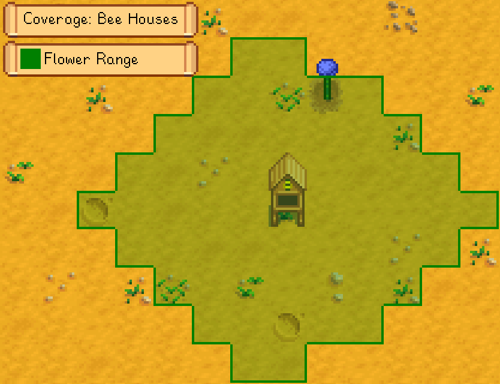
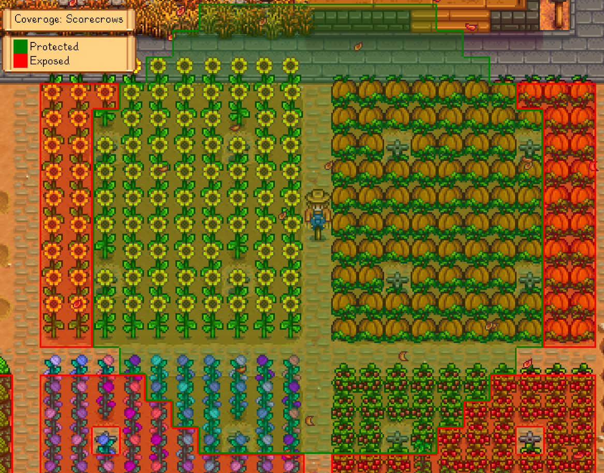
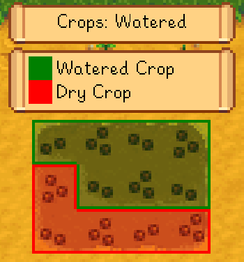

**Data Maps** is a [Stardew Valley](http://stardewvalley.net/) mod that overlays the world with
metadata maps.

## Contents
* [Install](#install)
* [Use](#use)
* [Configure](#configure)
* [Compatibility](#compatibility)
* [See also](#see-also)

## Install
1. [Install the latest version of SMAPI](https://smapi.io/).
2. [Install this mod from Nexus mods](https://www.nexusmods.com/stardewvalley/mods/1691).
3. Run the game using SMAPI.

## Use
Press `F2` to show the overlay, and then `left CTRL` and `right CTRL` to cycle between data maps
(buttons configurable).

For coverage maps (e.g. scarecrows or sprinklers), point at one with the cursor to see a blue
border around that one's range and a green border around the coverage without it.

Below are the current data maps.

### Accessibility
Shows where you can walk and highlights warp tiles; useful for finding hidden paths and nooks.
> 

### Coverage: bee houses
Shows bee houses' flower search range. (The weird shape isn't a bug, that's the game's
actual range.)
> 

### Coverage: Junimo huts
Shows Junimo hut coverage, and highlights crops they won't reach. Also works when placing a Junimo
hut from the Wizard's build menu. Compatible with Pelican Fiber.
> 

### Coverage: scarecrows
Shows scarecrow coverage, and highlights unprotected crops. Also works on scarecrows being placed.
> 

### Coverage: sprinklers
Shows sprinkler coverage, and highlights unsprinkled crops. Also works on sprinklers being placed.
Compatible with custom sprinkler coverage from Better Sprinklers, Cobalt, and Simple Sprinkler.
> 

### Crops: watered
Shows which crops have been watered today.
> 

### Crops: fertilised
Shows which crops have fertiliser applied.
> 

## Configure
The mod will work fine out of the box, but you can tweak its settings by editing the `config.json`
file if you want. These are the available settings:

setting    | what it affects
---------- | -------------------
`Controls` | The configured controller, keyboard, and mouse buttons (see [key bindings](https://stardewvalleywiki.com/Modding:Key_bindings)). You can separate multiple buttons with commas. The default values are `F2` to toggle the overlay, left `CTRL` or left controller shoulder for the previous map, and right `CTRL` or right controller shoulder for the next one.
`EnabledMaps` | Choose which maps you want to appear in-game. All maps are enabled by default.
`CombineOverlappingBorders` | Default `true`. When two groups of the same color overlap, draw one border around their edges instead of their individual borders.

## Compatibility
Data Maps is compatible with Stardew Valley 1.3+ on Linux/Mac/Windows, both single-player and
multiplayer. There are no known issues in multiplayer (even if other players don't have it
installed).

Data Maps will automatically show data from these mods if you have them installed:
* Better Sprinklers
* Cobalt
* Pelican Fiber
* Simple Sprinkler

## See also
* [Release notes](release-notes.md)
* [Nexus mod](https://www.nexusmods.com/stardewvalley/mods/1691)
* [Discussion thread](https://community.playstarbound.com/threads/data-maps.139625/)
